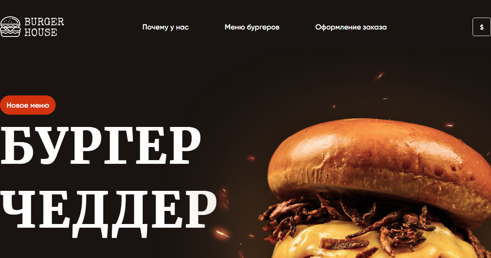

# Burger House

A one-page site for a burger restaurant: hero, reasons to order, a menu of twelve burgers
and an order form. Plain HTML, one stylesheet and one script — no framework, no build step
and no dependencies.

**Live demo:** https://tecna-developer.github.io/burgers-itlogia/



## Highlights

- **A currency switcher that keeps one canonical price.** Each menu item carries
  `data-base-price` in dollars, and the price shown is computed from it. Clicking the badge
  cycles `$ → ₽ → BYN → € → ¥ → $` and rewrites all twelve prices from that base, so the
  markup never stores the same burger at five different prices and no rounding error
  accumulates as you click around.

  ```
  8 $  →  640 ₽  →  24 BYN  →  7.2 €  →  55.2 ¥  →  8 $
  ```

  The rates are a hard-coded table, not a live feed.

- **Navigation without anchors.** Menu links carry `data-link="why|products|order"` instead
  of `href="#…"`, and the handler calls `scrollIntoView({ behavior: 'smooth' })` on the
  matching id. The scroll is animated and the URL stays clean — no hash and no history entry.

- **Every "Заказать" button leads to the same place.** The handler is attached in a loop over
  `.product-button`, so a new menu item needs no wiring: adding the class is enough for its
  button to scroll to the order form.

- **Form validation marks the field, not a message.** On submit, empty inputs get their
  wrapper painted red and the submit is stopped; a valid pass clears the fields and confirms.
  The check runs over one array of the three inputs, so the rule lives in a single place.

- **Fonts are self-hosted** — Gilroy for the interface, Merriweather for headings — loaded
  from `fonts/` with `@font-face` rather than fetched from a CDN.

- **Grid where the layout is a grid.** The two card rows, "why us" and the menu, are
  `display: grid`; everything else is flexbox. 377 lines of CSS in total.

## Running it

There is nothing to install and nothing to build. Open `index.html` in a browser, or serve
the folder:

```bash
npx serve
```

## Structure

```
index.html        the whole page: hero, why, products, order, footer
styles/style.css  every style, ordered by section
scripts/script.js smooth scrolling, order buttons, form validation, currency switching
fonts/            Gilroy and Merriweather, self-hosted
images/           photography and UI graphics
favicon.svg       the burger mark
favicon.png       32x32 fallback
og-image.png      1200x630 social preview
```

Section ids double as scroll targets: `why`, `products`, `order`.

## History

The repository was scaffolded with Angular CLI 16 and then built as a static page instead,
so it carried an Angular 16 dependency tree, a Karma/Jasmine test stack, `angular.json` and
three `tsconfig` files without a single component or TypeScript file to go with them. None
of it was ever reachable from the published page — GitHub Pages serves `index.html` from
the repository root — and all of it has been removed.

## Scope

Presentational. The order form validates but submits nowhere — a successful pass shows an
`alert()` and clears the inputs.

**The page is desktop-only.** There is not a single media query in the stylesheet, and the
layout is built on fixed pixel widths, so at a 390px viewport the document is still 1200px
wide and scrolls sideways by 825px. The `viewport` meta tag is present, which makes the
omission look deliberate when it is not. This is the one thing worth fixing if the project
is picked up again — every other project in this account is responsive.

Smaller leftover: the page `<title>` is "Бургер Чеддер" while the Open Graph title is
"Burger House", so the browser tab and a shared link disagree.
